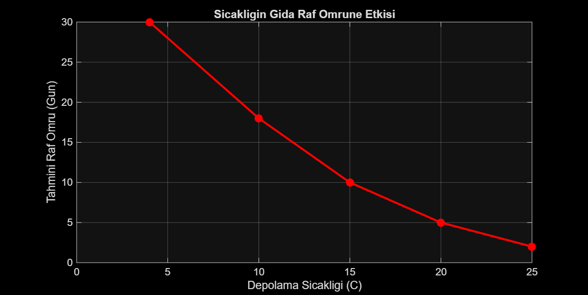

# Gıda Ürünlerinde Sıcaklığın Tahmini Raf Ömrüne Etkisi

Bu projede, farklı depolama sıcaklıklarının gıda ürünlerinin raf ömrü üzerindeki etkisi MATLAB ile modellenmiş ve basit bir veri analizi gerçekleştirilmiştir.

### Kullanılan Yöntem
- **Parametreler:** Depolama Sıcaklığı (°C) ve Tahmini Raf Ömrü (Gün)
- **Yaklaşım:** Sıcaklık artışının kinetik kalite kaybı üzerindeki ters orantılı etkisinin incelenmesi
- **Sonuç:** Sıcaklık yükseldikçe raf ömrünün belirgin şekilde azaldığı görselleştirilmiştir.

### Analiz Grafiği

### Proje Dosyaları
- `veri.csv.xlsx`: Model verileri
- `analiz.fig`: MATLAB grafik ve model dosyası
- `grafik.png`: Elde edilen analiz eğrisi
